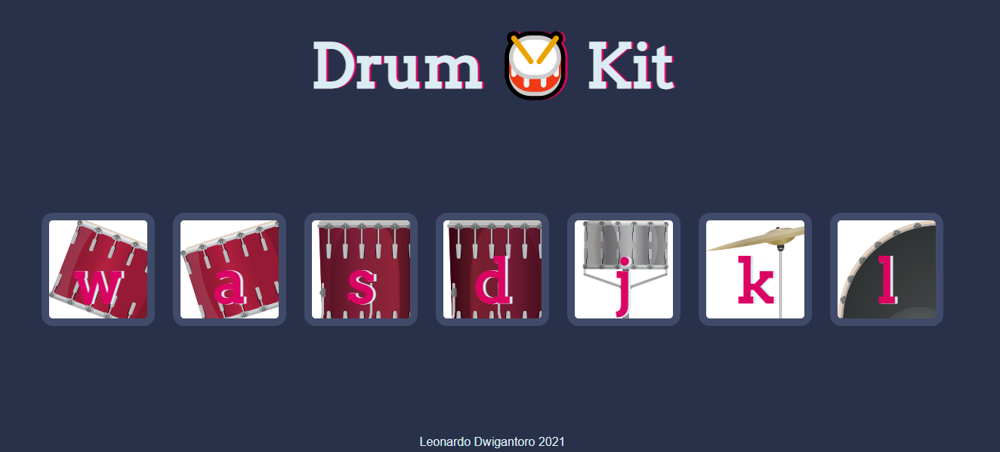

# Drum Kit 

Drum Kit is a collection of drums, cymbals and other percussion instruments, which are set up on stands to be played by a single player. This version of game created with HTML, CSS, Javascript, and also implementing DOM manipulation.

## Preview



## Installation

```bash
Download repo 
Run index.html
```

## Contributing
Pull requests are welcome. For major changes, please open an issue first to discuss what you would like to change.

Please make sure to update tests as appropriate.

## License
[MIT](https://choosealicense.com/licenses/mit/)